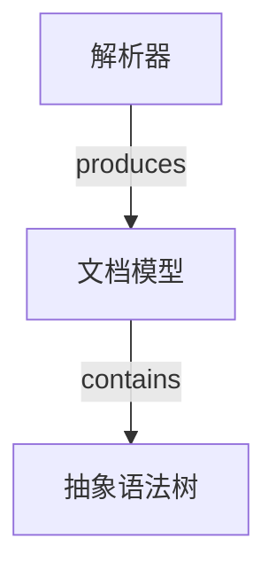

# LLM Wiki Compiler

把项目里的**原始资料**和**手绘的图**，编译成同一张可浏览、可检索、可校验的知识图谱。

```text
                     ┌→ Parser → Document Model → LLM Extraction → Knowledge IR
PDF / Markdown / TXT ┤
                     └→ Semantic Merge ─────────────────────────────┐
                                                                     ├→ Graph → Web UI
example.lw → Mermaid Parser → Parsed Model → Adapter ────────────────┘
```

- **文档知识入口**：`PDF / Markdown / TXT` 经解析、结构化、大模型抽取、语义合并，得到统一的 `KnowledgeBase`。
- **图语言入口**：`.lw` 文件就是 **Mermaid 语法**（不是自定义语法），解析后进入同一个 `Graph`。
- **产物**：带来源引用的 Markdown Wiki、页面内部链接、关键词搜索索引、内存知识图、质量检查（Lint）报告、本地 Web 图浏览器。
- **可选持久化**：Redis 以 **RDB + AOF 混合**方式保存运行时数据；AOF 损坏时自动隔离并回退 RDB，**不会**让服务起不来（见 [`redis/README.md`](redis/README.md)）。

## 目录

- [快速开始](#快速开始)
- [CLI 参考](#cli-参考)
- [Web UI](#web-ui)
- [`.lw`：用 Mermaid 描述图](#lw用-mermaid-描述图)
- [Redis 持久化（可选）](#redis-持久化可选)
- [作为库使用](#作为库使用)
- [架构](#架构)
- [设计原则](#设计原则)
- [测试](#测试)
- [项目结构](#项目结构)
- [已知限制](#已知限制)
- [路线图](#路线图)

## 快速开始

### 环境

- Python **3.10+**
- 依赖：`pip install -r requirements.txt`

| 依赖 | 用途 | 是否必需 |
| --- | --- | --- |
| `pypdf` | PDF 文本提取 | 是（只用 PDF 时） |
| `charset-normalizer` | 编码检测（GBK / Big5 等） | 建议安装 |
| `openai` | 真实的 LLM 客户端 | 可选 |
| `fpdf2` | 重新生成测试用 PDF 夹具 | 仅开发 |

没有 `charset-normalizer` 时编码会退化为"严格 UTF-8 → 严格 GB18030 → 严格 Big5 → 有损兜底"。

### 1. 看一张 `.lw`（Mermaid）图 —— 不需要任何 API Key

```powershell
python -m compiler examples/example.lw
```

```text
Loading examples\example.lw...
Mermaid parsed successfully.
Nodes: 3
Edges: 2
Building Graph...
Starting Web Server...
Web UI:
http://127.0.0.1:63333
```

浏览器打开 `http://127.0.0.1:63333`，看到 **解析器 →(produces) 文档模型 →(contains) 抽象语法树**。

### 2. 把知识图谱也放进同一个 Web UI

```powershell
python -m compiler --kb kb.json            # KnowledgeBase.to_dict() 的 JSON
python -m compiler --graph-json graph.json # Graph.to_dict() 的 JSON
```

### 3. 跑测试

```powershell
python -m pytest -q        # 586 passed, 2 skipped
```

（2 条 skip 分别是需要真实 `OPENAI_API_KEY` 的抽取测试和需要本机 Redis 的持久化测试。）

## CLI 参考

```text
usage: compiler [-h] [--kb FILE] [--graph-json FILE] [--host HOST]
                [--port PORT] [--no-browser] [--check] [--json] [-q]
                [source]
```

| 参数 | 说明 |
| --- | --- |
| `source` | `.lw` 图源文件路径 |
| `--kb FILE` | 不读 `.lw`，直接看一份 `KnowledgeBase` JSON（`KnowledgeBase.to_dict()` 的输出） |
| `--graph-json FILE` | 不读 `.lw`，直接看一份 `Graph` JSON（`Graph.to_dict()` 的输出） |
| `--host HOST` | 绑定地址，默认 `127.0.0.1`（仅本机访问） |
| `--port PORT` | 端口，默认 `63333` |
| `--no-browser` | 不自动打开浏览器，只打印 URL |
| `--check` | 只解析并报告节点/边数量，不起服务 |
| `--json` | 把图打印成 JSON 后退出（可用于脚本） |
| `-q, --quiet` | 只输出错误 |
| `--redis-check` | 检查 Redis 的 RDB/AOF：损坏则隔离并准备 RDB 回退；不启动 Redis、不因持久化问题崩溃 |
| `--redis-load KEY` | 从 Redis 读取 `KnowledgeBase`（替代文件输入） |
| `--redis-save KEY` | 载入后把 Graph（以及 KnowledgeBase）写入 Redis |
| `--redis-data-dir DIR` | Redis 数据目录，默认 `data/redis` |
| `--redis-strict` | 配合 `--redis-check`：无法验证持久化时退出码 2 |

三个输入（`source` / `--kb` / `--graph-json`）必须**且只能**给一个。出错时给出明确信息并返回退出码 2（参数/文件/语法错误）或 3（端口占用等服务器错误）：

```text
$ python -m compiler bad.lw
ParseError: bad.lw:2:11
Invalid Mermaid graph syntax: expected a node id
hint: .lw files use Mermaid graph syntax, for example:
  graph TD
      Parser[解析器] -->|produces| DocumentModel[文档模型]
```

## Web UI

`GET /` 返回单页界面，`GET /api/graph` 返回 `{nodes, edges, metadata}`，`GET /static/*` 返回静态资源，其余 404。服务只用标准库 `http.server`，图在启动时解析一次（改 `.lw` 后重新运行命令即可）。

界面能力：

- 节点 / 边 / 箭头 / 关系标签显示
- 按 `.lw` 的 `graph` 方向自动布局（`TD/TB/BT/LR/RL`，用 dagre；未加载时退回 breadthfirst）
- 拖动节点、滚轮缩放、空白处平移
- 点击节点查看详情（id、kind、来源行号、出边、入边）
- 搜索框按 id / label 高亮并聚焦
- 底部显示 `Nodes / Edges` 统计

图形库（cytoscape.js + dagre）来自 CDN；**离线时**页面会自动降级成节点/边的文本列表，并在顶部提示。想完全离线，把三个 js 下载到 `compiler/web/static/` 并改 `index.html` 的引用即可。

## `.lw`：用 Mermaid 描述图

`.lw` **没有自定义语法**，文件内容就是 Mermaid；第一版只支持 Graph 子集。



**支持**：`graph`/`flowchart` + `TD/TB/LR/RL/BT`；裸节点；`A[Label]`、`A["Label"]`；`A --> B`、`A -->|label| B`、`A -- label --> B`；链式 `A --> B --> C`；`A <--> B`（双向，展开成两条有向边并标记 `bidirectional`）；隐式节点；重复节点声明；`%%` 注释；`;` 分隔；中文 id 与 label。

**明确拒绝并给出位置**：`subgraph`、`style`、`classDef`、`click`、`linkStyle`、`direction`、`%%{...}%%`、`---`/`-.->`/`==>` 等其它连接符、`()`/`{}` 等其它节点形状，以及 sequence/class/state/er/gantt/pie 等其它图类型。

**ID 与 Label 分离**：`A[解析器]` 里 `A` 是节点身份（`Node.id`），`解析器` 是显示名（`Node.title`）。边的 `type` 直接取关系标签；没有标签就是空字符串，**不会臆造** `related`。

## Redis 持久化（可选）

Redis 在这里是**可选的运行时存储**：把编译产物（`KnowledgeBase` / `Graph`）存进去，让下一次运行不必重新解析或再调用大模型；它不替代流水线写出的文件。

```text
scripts/redis-persistence.sh        # 管进程与文件（WSL / systemd）
        │  RDB 检查 → AOF 检查（redis-check-aof）
        │  AOF 损坏 → 改名隔离到 data/redis/corrupted/（绝不删除）
        │            → 复制一份 --fix 并复验 → 成功则使用
        │            → 否则回退最新 RDB，并警告"之后的写入可能丢失"
        ▼
Redis（appendonly yes / appendfsync everysec / aof-use-rdb-preamble yes）
        ▲
compiler/persistence/               # 应用侧：自检 + 日志 + 永不崩溃
        └─ python -m compiler --redis-check
```

```powershell
# WSL 里启动受管 Redis（RDB + AOF）
bash scripts/redis-persistence.sh

# 只做检查与恢复准备（不启动 Redis，可随时运行）
python -m compiler --redis-check

# 把编译结果存进 Redis / 从 Redis 读出来
python -m compiler --kb kb.json --redis-save my-key --check
python -m compiler --redis-load my-key --check
```

完整说明、日志样例和"如何人为制造 AOF 损坏来验证不会崩"在 [`redis/README.md`](redis/README.md)。

## 作为库使用

### 文档流水线（PDF / Markdown / TXT → Wiki / 搜索 / 图 / Lint）

```python
import json

from compiler.document import load_document
from compiler.extraction import extract_knowledge
from compiler.llm import OpenAIChatClient          # 需要 OPENAI_API_KEY
from compiler.merge import LLMJudge, merge_knowledge_bases
from compiler.wiki import generate_wiki
from compiler.linker import resolve_wiki
from compiler.search import index_wiki, search
from compiler.graph import build_graph
from compiler.lint import lint

client = OpenAIChatClient()
judge = LLMJudge(client)

documents = [load_document(path) for path in ("notes.md", "manual.txt")]
knowledge_irs = [extract_knowledge(document, client) for document in documents]
knowledge_base = merge_knowledge_bases(knowledge_irs, judge)

build = generate_wiki(knowledge_base, "wiki")       # Markdown Wiki（带来源）
links = resolve_wiki(build)                         # 页面内部链接
index = index_wiki("wiki")                          # 搜索索引
print([hit.path for hit in search(index, "解析器")])

graph = build_graph(knowledge_base)                 # 知识图
report = lint(knowledge_base, wiki_build=build, link_result=links, graph=graph)
print(report.counts)

json.dump(knowledge_base.to_dict(), open("kb.json", "w", encoding="utf-8"), ensure_ascii=False)
```

### 只处理 `.lw` 图

```python
from compiler.lw import load_lw_file, to_graph
from compiler.web import serve_graph

graph = to_graph(load_lw_file("example.lw"))
serve_graph(graph)                                  # http://127.0.0.1:63333
```

## 架构

| 阶段 | 包 | 职责 | 主要入口 |
| --- | --- | --- | --- |
| Parser | `compiler.parser` | PDF / Markdown / TXT → 文本 + 解析元数据（编码、front matter、逐页文本） | `parse_file` |
| Document Model | `compiler.document` | 文档结构：sections 树、页面/行锚点、序列化 | `load_document` |
| LLM Extraction | `compiler.extraction` | 提示词 → LLM → JSON → 校验 → `Knowledge IR` | `extract_knowledge` |
| LLM 客户端 | `compiler.llm` | `LLMClient` 协议 + 可选 OpenAI 客户端 | `OpenAIChatClient` |
| Knowledge IR | `compiler.knowledge` | `Entity / Concept / Fact / Relation / SourceRef`、`KnowledgeBase` | — |
| Semantic Merge | `compiler.merge` | 归一化 → 候选匹配 → LLM 判同 → 合并（来源并集） | `merge_knowledge_bases` |
| Wiki Generator | `compiler.wiki` | 每个知识对象一个 Markdown 页 + index（确定性、无链接） | `generate_wiki` |
| Link Resolver | `compiler.linker` | 名称/别名 → 页面，Markdown 感知地加内部链接（无死链） | `resolve_wiki` |
| Search | `compiler.search` | 只读 Wiki 目录建索引，关键词检索 + 片段 | `index_wiki`, `search` |
| Graph | `compiler.graph` | `KnowledgeBase` → `Node` / `Edge` / `Graph` + 简单查询 | `build_graph` |
| Lint | `compiler.lint` | 死链、孤儿页、无来源知识、未连线事实/关系、歧义名、图结构问题 | `lint` |
| `.lw` 图源 | `compiler.lw` | Mermaid 子集解析 → Parsed Model → 适配进同一个 `Graph` | `load_lw_file`, `to_graph` |
| Web UI | `compiler.web` | 标准库 HTTP 服务 + 单页图浏览器 | `serve_graph` |
| CLI | `compiler.cli` | 命令行入口 | `python -m compiler` |

依赖方向是单向的：上层只读取下层的结果，**不改输入**；`Graph` 同时是文档入口和 `.lw` 入口的目标。

## 设计原则

- **确定性优先**：除 LLM 抽取/判同外，所有环节都是纯代码；输出按固定键排序，同一输入产生同样的字节。
- **来源不丢**：每条知识、每个 Wiki 页面、每条图边都保留 `SourceRef`（文档 id / section / 页码 / 原文片段）。
- **不修改输入**：`generate_wiki` 不改 `KnowledgeBase`，`resolve_wiki` 不改 Wiki 之外的任何东西，`lint` 只读。
- **阶段边界清楚**：Wiki Generator 不生成链接，Link Resolver 不生成页面，Search 只读 Markdown，Graph 不解析 Markdown，Lint 只报告不修复。
- **能少依赖就少依赖**：图、搜索、服务、`.lw` 解析都是标准库实现；只有 PDF 与真实 LLM 需要第三方库。
- **测试用 Mock**：单元测试用脚本化的 LLM/Judge，不联网、不需要 Key。

## 测试

```powershell
python -m pytest -q                 # 539 passed, 1 skipped
python -m pytest tests/lw -q        # 只测 .lw / Mermaid 子集解析与适配
python -m pytest tests/web -q       # 只测 Web 服务（GET / 与 /api/graph）
python -m pytest tests/test_cli.py -q

# 可选：真实模型集成测试（默认跳过）
$env:OPENAI_API_KEY="..."; python -m pytest tests/test_extraction_live.py -q

# 可选：重新生成 PDF 夹具
python tests/fixtures/make_fixtures.py
```

测试覆盖：解析（UTF-8/GBK/Big5/BOM、中文 PDF）、Document Model、抽取（正常/非法 JSON/缺字段/空结果/中文）、语义合并（去重、别名、歧义、来源并集）、Wiki 生成（命名、确定性、无链接）、链接解析（死链、自引用、幂等）、搜索（排序、片段）、图（节点/边/自环/悬空）、Lint（每条规则与只读性）、`.lw`（语法子集、错误定位、适配）、Web（HTTP 端点）、CLI（退出码与参数）。

## 项目结构

```text
compiler/
├── compiler/
│   ├── parser/       # PDF / Markdown / TXT
│   ├── document/     # Document Model
│   ├── extraction/   # 提示词、响应解析、校验、Extractor
│   ├── llm/          # LLMClient 协议 + OpenAI 客户端
│   ├── knowledge/    # Knowledge IR / KnowledgeBase
│   ├── merge/        # Semantic Merge
│   ├── wiki/         # Wiki Generator
│   ├── linker/       # Link Resolver
│   ├── search/       # Search
│   ├── graph/        # Graph
│   ├── lint/         # Lint
│   ├── lw/           # .lw = Mermaid 图源（解析 + 适配）
│   ├── persistence/  # Redis RDB + AOF 自检、隔离、回退、RedisStore
│   ├── web/          # 本地 Web 服务与 UI（static/）
│   ├── cli.py        # 命令行
│   └── __main__.py   # python -m compiler
├── examples/example.lw
├── redis/            # redis.conf + 持久化说明
├── scripts/          # redis-persistence.sh / .ps1
├── tests/            # 586 passed, 2 skipped
└── requirements.txt
```

## 已知限制

- PDF 只做**文本层提取**（没有 OCR）；扫描件会得到空文本，页码会记录在 `metadata["empty_pages"]`。
- 长文档目前**整篇一次抽取**，超出上下文窗口需要后续做分块。
- 语义合并只解决实体/概念去重与事实/关系合并：没有别名桥接的跨语言同义、跨类型（entity ↔ concept）合并、事实措辞级去重都未实现。
- Lint 只报告不修复；只检查链接目标存在性，不校验锚点。
- `.lw` 只支持 Mermaid 的 Graph 子集，其余语法明确报错；没有热更新（改文件后重新运行命令）。
- Web UI 的图形库走 CDN（离线自动降级为文本列表）。
- 编码检测**优先中文编码**（UTF-8 / GB18030 / Big5）；其它旧编码请显式传 `encoding=`。
- Redis 持久化需要本机/WSL 里有 `redis-server` 与 `redis-check-aof`；`tests/persistence/test_redis_live.py` 在没有 Redis 时会自动跳过。

## 路线图

- 文档流水线的 CLI（`python -m compiler notes.md --wiki --serve`）
- `.lw` 与知识图谱的合并视图（两者本就是同一种 `Graph`）
- 在应用启动流程中接入 `PersistenceManager.ensure()` 的自动报告（当前由 `--redis-check` 显式触发）
- Web UI 热更新、导出 SVG/PNG、按 kind 上色
- 更多 Mermaid 语法（`subgraph`、更多形状、`click`、样式）
- 长文档分块抽取与跨块合并
